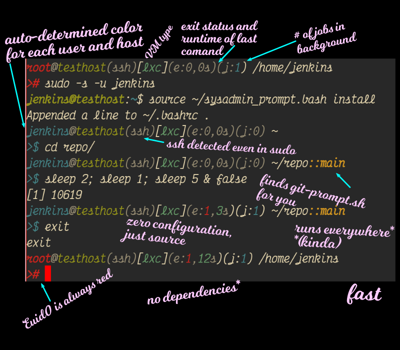

The sysadmin prompt
===================

You have your favourite shell (which is of course fish) throughly configured
and customised.  But despite all your terraforms and ansibles and sshfses, your
job as a sysadmin requires you to ssh-hop between a large number of servers and
VMs to herd dæmons.  And often you're in some service-specific account in the
middle of nowhere with nothing but the default prompt of your distro.

The sysadmin prompt is designed to be a zero-configuration drop-in file that
will run anywhere,¹ and give you information useful to have on every line.
Extra frills are provided when available, and won't generate errors when
not.

Install
=======

Just put the script anywhere you like, source it at the end of `.bashrc` and
you're set.  Or do this:

    wget https://raw.githubusercontent.com/melissaboiko/sysadmin-prompt.bash/trunk/sysadmin_prompt.bash
    source sysadmin_prompt.bash install

and it will append a line to `.bashrc` for you.

Prompt features
===============

 - Automatically chosen but deterministic colours for user- and hostnames,
   making changes in environment more noticeable;
 - user@hostname always present, with root shells always in red (including
   root aliases like BSD `toor`);
 - Detects SSH even under sudo;
 - Basic virtual machine detection;
 - Exit status of last command;
 - Time elapsed for last command (seconds resolution, won't count time spent at
   prompt);
 - How many jobs are hanging in background for this shell;
 - Whole rest of line for current path;
 - Including, if the standard git-prompt.sh (or variations) is found, git
   information;
 - A newline for clarity;
 - A continuation character and the standard shell prompt character, always in
   the same screen position, and highlighted for root sheels.

TODO
====
 - Light background mode.
 - Better perfomance on android.
 - Test suite.

Compatibility notes
===================

This prompt has been tested extensively on recent-ish Linux+bash combos (ca.
2017 onwards).

It's also been used with zero configuration on BSD, OpenWRT, pfSense, LXD-LXC
containers, and Docker containers.  No seeming issues, but not as tested.

Suport for Android bash under adb is preliminary.  The current release may
need manual installation, and not be as performant.

Pull requests for portability will be accepted, including for older bash
versions, but this project isn't meant for POSIX sh or zsh or other shells (if
you can run better shells, it's probably a host you can configure freely and
run fish, right?).  Contributors please take care with performance hits in the
`prompt_command` function.
